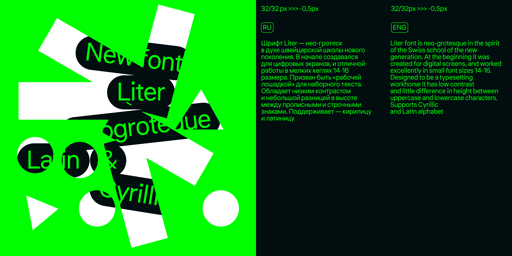

# Liter 

[![][Fontbakery]](https://Element-Type.github.io/HostGrotesk/fontbakery/fontbakery-report.html)
[![][Universal]](https://Element-Type.github.io/HostGrotesk/fontbakery/fontbakery-report.html)
[![][GF Profile]](https://Element-Type.github.io/HostGrotesk/fontbakery/fontbakery-report.html)
[![][Outline Correctness]](https://Element-Type.github.io/HostGrotesk/fontbakery/fontbakery-report.html)
[![][Shaping]](https://Element-Type.github.io/HostGrotesk/fontbakery/fontbakery-report.html)

[Fontbakery]: https://img.shields.io/endpoint?url=https%3A%2F%2Fraw.githubusercontent.com%2FElement-Type%2FHostGrotesk%2Fgh-pages%2Fbadges%2Foverall.json
[GF Profile]: https://img.shields.io/endpoint?url=https%3A%2F%2Fraw.githubusercontent.com%2FElement-Type%2FHostGrotesk%2Fgh-pages%2Fbadges%2FGoogleFonts.json
[Outline Correctness]: https://img.shields.io/endpoint?url=https%3A%2F%2Fraw.githubusercontent.com%2FElement-Type%2FHostGrotesk%2Fgh-pages%2Fbadges%2FOutlineCorrectnessChecks.json
[Shaping]: https://img.shields.io/endpoint?url=https%3A%2F%2Fraw.githubusercontent.com%2FElement-Type%2FHostGrotesk%2Fgh-pages%2Fbadges%2FShapingChecks.json
[Universal]: https://img.shields.io/endpoint?url=https%3A%2F%2Fraw.githubusercontent.com%2FElement-Type%2FHostGrotesk%2Fgh-pages%2Fbadges%2FUniversal.json

Liter font is neo-grotesque in the spirit of the Swiss school of the new generation. At the beginning it was created for digital screens, and worked excellently in small font sizes 14-16. Designed to be a typesetting workhorse It has low contrast and little difference in height between uppercase and lowercase characters. Supports Cyrillic and Latin alphabet

## About

Liter, designed by [Anton Skugarov](https://skugarov.com) & Alex Ivanin

## Building

Fonts are built automatically by GitHub Actions - take a look in the "Actions" tab for the latest build.

If you want to build fonts manually on your own computer:

* `make build` will produce font files.
* `make test` will run [FontBakery](https://github.com/googlefonts/fontbakery)'s quality assurance tests.
* `make proof` will generate HTML proof files.

The proof files and QA tests are also available automatically via GitHub Actions - look at https://skugiz.github.io/liter.

## Changelog

**14 August 2023. Version 1.00**
- Updated character set to GF Latin Core

## License

This Font Software is licensed under the SIL Open Font License, Version 1.1.
This license is available with a FAQ at
https://scripts.sil.org/OFL

## Repository Layout

This font repository structure is inspired by [Unified Font Repository v0.3](https://github.com/unified-font-repository/Unified-Font-Repository), modified for the Google Fonts workflow.

