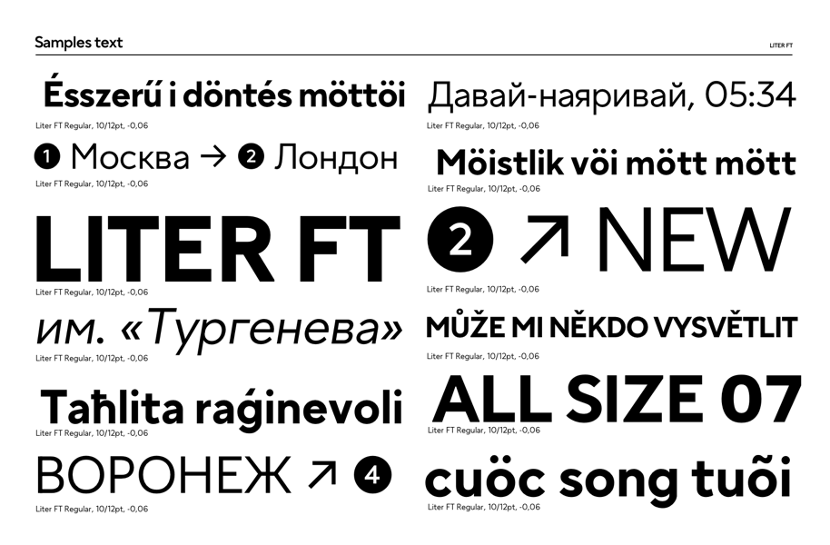

## Introduction

Liter is a universal font in the spirit of German geometric grotesques. Created under the influence of modern grotesques — Futura and Graphik.

The font has a low contrast and a slight difference in height between uppercase and lowercase characters. This allows you to use the font for the widest possible range of tasks: accidents, typing solid text, interface tasks, navigation.

The structure includes Cyrillic, Latin, punctuation and special characters. And also very necessary and useful characters — case-sensitive characters, superscript and subscript numbers, fractions.

At the moment, Liter — [minimum viable product](http://en.wikipedia.org/wiki/Minimum_viable_product) (is presented in one style regular/italic) by March 2020. But it is planned to expand to 7 styles.

Font — an educational project by designer [Anton Skugarov](http://skugarov.com).

## Comments, Contributions
If you find a mistake, or want to give feedback write me an email <a href="mailto:kugiz@gmail.com">skugiz@gmail.com</a> or create [Issue](../../issues).

## All the Thanks 
Special thanks for the development of the project — [Aleksander Ivanin](https://vk.com/aliv65), [Alex Slobzheninov](https://www.instagram.com/slobzheninov/) and [Kate Symidi](https://www.instagram.com/symidi/).

## License
Liter is licensed under the SIL Open Font License v1.1 (<http://scripts.sil.org/OFL>)

To view the copyright and specific terms and conditions please refer to [OFL.txt](OFL.txt).

###### H6 Designed by Inno
